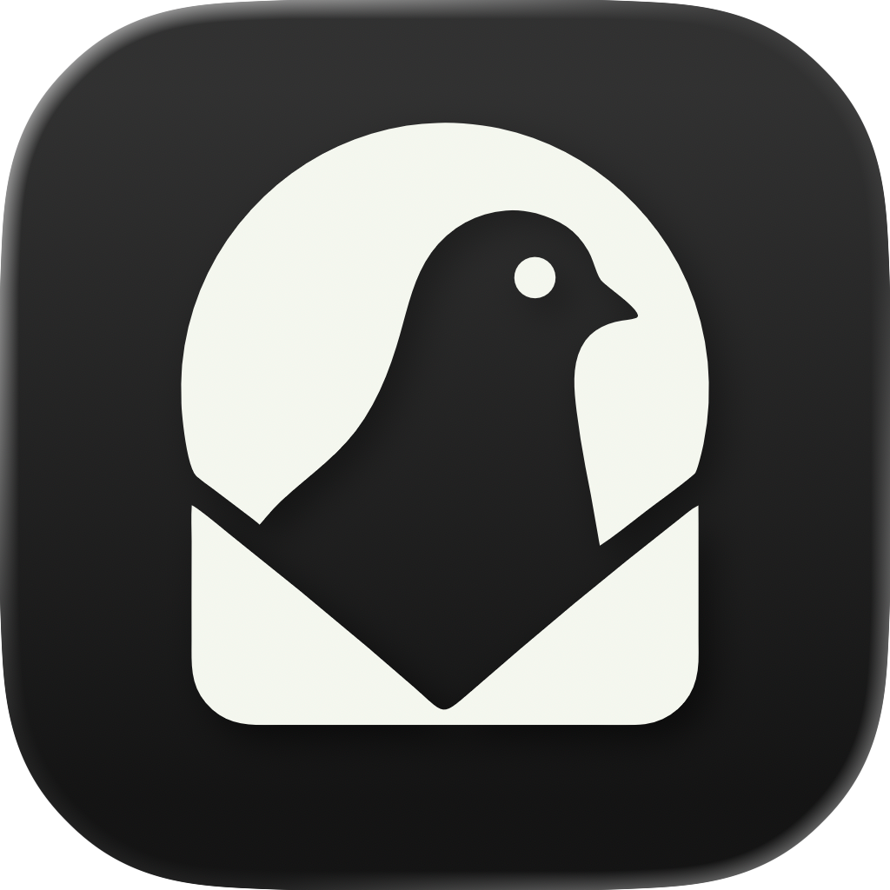
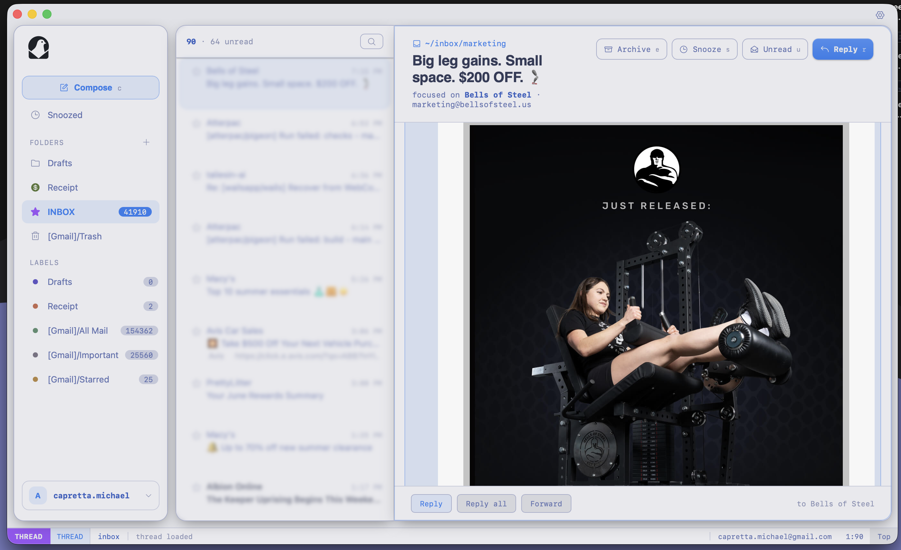
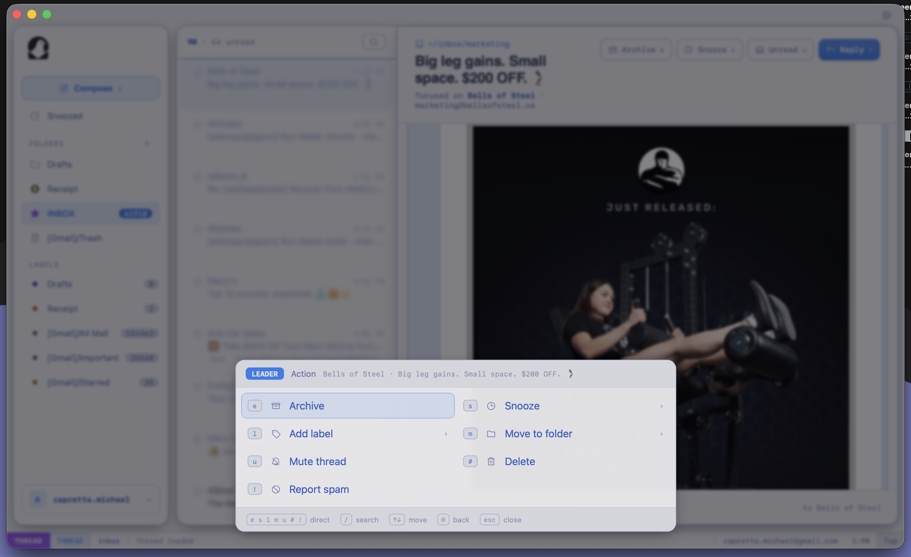
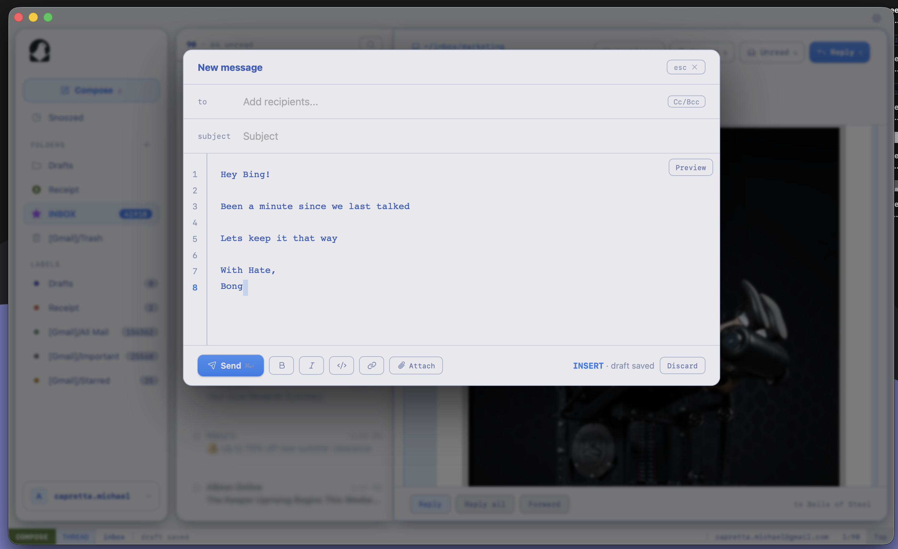
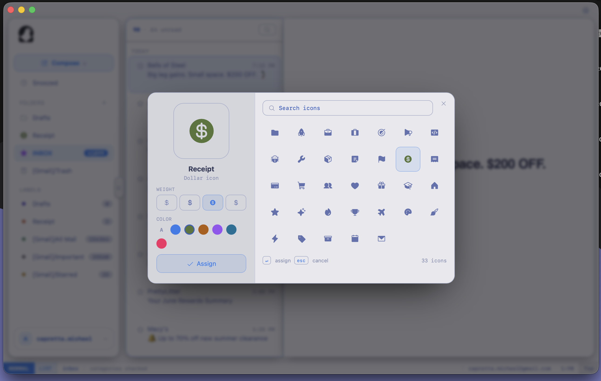
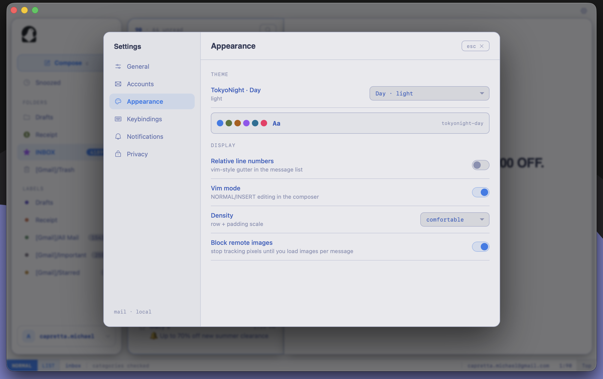

<p align="center">
  
</p>

<h1 align="center">Pigeon</h1>

<p align="center">A keyboard-focused email client. Go + Vue, built with <a href="https://v3.wails.io">Wails 3</a>.</p>

<p align="center">
  
</p>

## Features

- **Vim-style keyboard control** — j/k navigation, count prefixes (`5j`), `v` visual multi-select, `:` ex-commands, `/` search, `?` help.
- **Fast triage** — archive / snooze / delete / spam / label / move, in batch, all with undo (consecutive actions collapse into one).
- **Compose** — reply / reply-all / forward with threading, draft autosave, configurable undo-send window, attachments (≤25MB), per-account HTML signatures with inline images.
- **Search** — local + server-side, operators (`from:` `to:` `subject:` `is:` `after:` `before:`), saved searches.
- **Sync** — IMAP IDLE push for the inbox, incremental UID/CONDSTORE sync, configurable poll interval, multiple accounts.
- **Notifications** — native configurable desktop alerts with modes (all / inbox-only / off), muted senders, quiet hours.
- **Privacy** — remote images blocked by default, so tracking pixels never fire on open (load per-message when you choose).
- **Customizable UI** — themes, density, and swappable compose / sidebar / nav / settings layouts.

## Screenshots

<table>
  <tr>
    <td width="50%" valign="top"><b>Keyboard triage</b> — the leader menu: archive, snooze, label, move, delete.<br/></td>
    <td width="50%" valign="top"><b>Compose</b> — vim-style line-numbered composer with draft autosave.<br/></td>
  </tr>
  <tr>
    <td width="50%" valign="top"><b>Folder icon studio</b> — assign an icon, weight, and color.<br/></td>
    <td width="50%" valign="top"><b>Settings</b> — themes, density, vim mode, remote-image blocking.<br/></td>
  </tr>
</table>

## Build from source

### Prerequisites

- Go 1.26+
- [Wails 3](https://v3.wails.io) CLI (`wails3`)
- [`just`](https://github.com/casey/just)
- [pnpm](https://pnpm.io)
- C toolchain (CGO required for the native webview on Linux and macOS)
- Linux only: GTK4 + WebKitGTK 6.0 dev libs — `libgtk-4-dev libwebkitgtk-6.0-dev` (Ubuntu 24.04+)

### Build

```sh
just build          # host binary -> bin/Pigeon
just bundle         # distributable for the host OS (see below)
just run            # build frontend + launch for local dev
```

`just bundle` dispatches by host OS: macOS `.app`, Linux AppImage, Windows NSIS installer — all into `bin/`. Cross-OS bundling isn't supported; build each target on its own OS. `just build-frontend` regenerates Wails bindings, builds the Vue app, and copies it to `cmd/email/dist`.

Run `just` (no args) for the full recipe list.

## Accounts

Pigeon is **IMAP + SMTP only, no OAuth**. OAuth would mean running a redirect server and passing Google's app-verification review; not worth it for a personal client. You authenticate with a per-app password instead.
There is maybe a day where I implement the server so others can "roll their own" OAuth, but that day is not today.

### Gmail

1. Enable 2-Step Verification on your Google account.
2. Create an **App Password** at <https://myaccount.google.com/apppasswords>.
3. Add the account in Pigeon using that 16-character password

Defaults: IMAP `imap.gmail.com:993` (TLS), SMTP `smtp.gmail.com:587` (STARTTLS). Any other provider works just supply its IMAP/SMTP host, ports, and an app password.

## Roadmap

- **Gmail/Outlook auth** — OAuth for Outlook / Microsoft 365 since app passwords are being phased out there :(, via the self-hostable "roll your own" auth server mentioned above.
- **Compose & visualization** — richer compose UX and better thread/message rendering.
- **Local data server** — HTTP or RPC endpoints to read cached mail/data straight from the local SQLite store (scripting, integrations, other clients/LLMs etc)

## License

[MIT](LICENSE) © 2026 Atterpac
